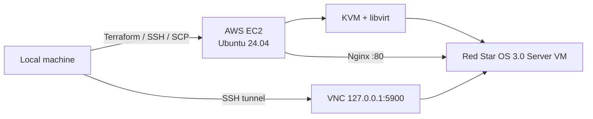

<div align="center">

# aws-redstar3.0-server

<p>
  
  
  
  
</p>

<p>
  <a href="README.md"></a>
  <a href="README.en.md"></a>
  
  
  
</p>

Terraform and shell automation for running Red Star OS 3.0 Server inside a KVM virtual machine on AWS EC2 with nested virtualization.

</div>

> This repository does not include Red Star OS ISO images. It only provides infrastructure code, host bootstrap scripts, and VM lifecycle tooling.

## Overview

The default deployment targets an Ubuntu 24.04 EC2 host in `ap-northeast-2`. Terraform provisions the network, security group, SSH key, and EC2 instance, while `user_data.sh` bootstraps KVM, libvirt, and Nginx.

A 32-bit Red Star OS 3.0 Server guest runs on top of the host. Installation is performed through VNC over an SSH tunnel, and the host-side Nginx service can act as a gateway to the guest web server after installation.

| Layer | Configuration |
| --- | --- |
| Cloud | AWS EC2 / VPC / Security Group |
| Host OS | Ubuntu 24.04 LTS |
| Infrastructure | Terraform >= 1.5 |
| Virtualization | KVM + QEMU + libvirt |
| Guest | Red Star OS 3.0 Server, 32-bit |
| VM profile | 2 vCPU / 2 GB RAM / 40 GB qcow2 / e1000 |
| Console | VNC `:5900` over SSH tunnel |
| Web gateway | Nginx `:80` → guest `:80` |

## Architecture



The installer uses two ISO images.

```text
redstar-boot.iso
        |
        | boot
        v
 Red Star installer
        |
        | requests disc 2
        v
redstar-install.iso
        |
        v
 redstar-server.qcow2
```

## Quick Start

### 1. Provision the infrastructure

```bash
terraform -chdir=infra init
terraform -chdir=infra apply
```

Default values:

```text
region        = ap-northeast-2
instance_type = c8i.xlarge
root_volume   = 80 GB gp3
```

For a safer SSH configuration, restrict access to your own public IP or management network.

```bash
terraform -chdir=infra apply \
  -var='allowed_ssh_cidr=<YOUR_PUBLIC_IP>/32'
```

Inspect the generated outputs after deployment:

```bash
terraform -chdir=infra output
```

The outputs include the public IP, instance information, SSH command, VNC tunnel command, web URL, and generated private-key path.

### 2. Prepare and upload the ISOs

Place the two required ISO images in your local Downloads directory.

```text
redstar3.0_SERVER_boot.iso
redstar3.0_SERVER_rss3_32_key_gui_20131212.iso
```

Then run:

```bash
./scripts/upload-isos.sh
```

The script automatically discovers the download directory, searches matching filenames, calculates SHA256 checksums, skips identical remote files, uploads via SCP, and normalizes the remote filenames to:

```text
/var/lib/libvirt/images/redstar-boot.iso
/var/lib/libvirt/images/redstar-install.iso
```

### 3. Create the VM

```bash
./scripts/create-redstar-vm.sh
```

When launched from a local machine, the script reads the EC2 address from Terraform output and executes `virt-install` on the remote host.

Default VM profile:

```text
name      redstar-server
vCPU      2
RAM       2048 MB
disk      40 GB qcow2
disk bus  virtio
NIC       e1000
CD-ROM    IDE / hdc
graphics  VNC 127.0.0.1:5900
```

If `/dev/kvm` is unavailable, the script falls back to QEMU TCG emulation, which is significantly slower.

### 4. Connect to VNC

VNC is bound only to `127.0.0.1:5900` on the EC2 host instead of being exposed directly to the Internet.

Print the generated tunnel command:

```bash
terraform -chdir=infra output -raw vnc_tunnel_command
```

Or create the tunnel manually:

```bash
ssh -i infra/redstar-key.pem \
  -N -L 5900:127.0.0.1:5900 \
  ubuntu@<EC2_PUBLIC_IP>
```

Connect your VNC viewer to:

```text
127.0.0.1:5900
```

### 5. Swap to the second installation ISO

When the installer requests the second disc, run this before confirming the dialog in VNC:

```bash
./scripts/switch-to-install-iso.sh
```

The script detects the CD-ROM target from the VM XML and uses `virsh change-media` to insert `redstar-install.iso`.

To switch back to the boot ISO:

```bash
./scripts/switch-to-boot-iso.sh
```

### 6. Eject installation media

Before rebooting the installed guest:

```bash
./scripts/eject-redstar-iso.sh
```

The VM can then boot from `redstar-server.qcow2`.

## Web Gateway

The host-side Nginx configuration uses the following default upstream:

```text
http://192.168.122.100:80
```

If the guest web service is not ready, Nginx displays a local status page.

If libvirt DHCP assigns another address to the guest, discover the actual lease and update `proxy_pass`.

```bash
sudo virsh net-dhcp-leases default
sudo nano /etc/nginx/sites-available/redstar.conf
sudo nginx -t
sudo systemctl reload nginx
```

## Security Notes

The repository contains development-oriented defaults that should be reviewed before long-term Internet exposure.

- `allowed_ssh_cidr` defaults to `0.0.0.0/0`; restrict it whenever possible.
- Security Group ports `80/tcp` and `443/tcp` are publicly accessible by default.
- VNC `5900/tcp` is not opened in the Security Group and QEMU binds it to localhost.
- Terraform writes the generated private key to `infra/redstar-key.pem`, which is excluded by `.gitignore`.
- ISO images, qcow2 disks, Terraform state, `.tfvars`, and private keys are also ignored.

## Project Structure

```text
.
├── infra/
│   ├── main.tf                  AWS network, security group, SSH key, EC2
│   ├── variables.tf             Region, instance type, SSH CIDR, etc.
│   ├── outputs.tf               IP, SSH/VNC commands, web URL
│   ├── versions.tf              Terraform/provider versions
│   └── user_data.sh             KVM, libvirt, Nginx bootstrap
│
├── scripts/
│   ├── upload-isos.sh           ISO discovery, checksum verification, SCP
│   ├── create-redstar-vm.sh     qcow2 creation and VM provisioning
│   ├── switch-to-install-iso.sh install ISO hot-swap
│   ├── switch-to-boot-iso.sh    switch back to boot ISO
│   ├── eject-redstar-iso.sh     eject virtual CD-ROM media
│   └── keygen.sh                separate local helper wrapper
│
├── libvirt/
│   └── redstar-vm.xml.template  reference VM domain template
│
├── nginx/
│   └── redstar.conf             reverse-proxy example for the guest
│
└── docs/
    ├── architecture.md          detailed architecture
    ├── redstar_install_guide.md installation walkthrough
    └── troubleshooting.md       troubleshooting
```

## Documentation

- [Architecture](docs/architecture.md)
- [Installation guide](docs/redstar_install_guide.md)
- [Troubleshooting](docs/troubleshooting.md)

## Cleanup

Destroy the Terraform-managed AWS resources when you are finished:

```bash
terraform -chdir=infra destroy
```

Back up any guest data you need before destroying the instance.

## Disclaimer

This repository does not distribute Red Star OS itself and does not grant rights to any ISO image or third-party software. Users are responsible for complying with applicable laws, licenses, and service terms for the media and environments they use.
