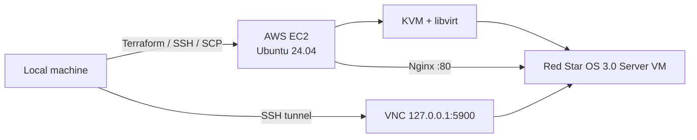

<div align="center">

# aws-redstar3.0-server

<p>
  
  
  
  
</p>

<p>
  <a href="README.md"></a>
  <a href="README.en.md"></a>
  
  
  <a href="https://github.com/seohuda/aws-redstar3.0-server/actions/workflows/validate.yml"></a>
  
  
</p>

AWS EC2 위에 KVM 중첩 가상화를 구성하고, 그 안에서 Red Star OS 3.0 Server를 구동하기 위한 Terraform + Shell 자동화 프로젝트.

</div>

> 이 저장소에는 Red Star OS ISO 이미지가 포함되어 있지 않습니다. 인프라 코드, 호스트 초기화 스크립트, VM 생성 및 운영 도구만 제공합니다.

## Overview

기본 배포 대상은 서울 리전(`ap-northeast-2`)의 Ubuntu 24.04 EC2 호스트입니다. Terraform이 네트워크와 보안 그룹, SSH 키, EC2 인스턴스를 생성하고, `user_data.sh`가 KVM/libvirt/Nginx 환경을 자동으로 준비합니다.

그 위에 32-bit Red Star OS 3.0 Server VM을 만들고, 설치 과정은 SSH 터널을 통한 VNC로 진행합니다. 설치가 끝난 뒤에는 EC2 호스트의 Nginx를 게이트웨이로 사용해 게스트 웹 서버에 접근할 수 있습니다.

| Layer | 구성 |
| --- | --- |
| Cloud | AWS EC2 / VPC / Security Group |
| Host OS | Ubuntu 24.04 LTS |
| Infrastructure | Terraform >= 1.5 |
| Virtualization | KVM + QEMU + libvirt |
| Guest | Red Star OS 3.0 Server, 32-bit |
| VM profile | 2 vCPU / 2 GB RAM / 40 GB qcow2 / e1000 |
| Console | VNC `:5900` over SSH tunnel |
| Web gateway | Nginx `:80` → guest `:80` |

## Architecture



설치 미디어는 2장 구조입니다.

```text
redstar-boot.iso
        │
        │ boot
        ▼
 Red Star installer
        │
        │ "두번째 설치원반" 요청
        ▼
redstar-install.iso
        │
        ▼
 redstar-server.qcow2
```

## Quick Start

### 1. 인프라 배포

```bash
terraform -chdir=infra init
terraform -chdir=infra apply
```

기본값은 다음과 같습니다.

```text
region        = ap-northeast-2
instance_type = c8i.xlarge
root_volume   = 80 GB gp3
```

SSH를 인터넷 전체에 열지 않으려면 배포 시 접속할 IP 대역을 지정하는 것을 권장합니다.

```bash
terraform -chdir=infra apply \
  -var='allowed_ssh_cidr=<YOUR_PUBLIC_IP>/32'
```

배포가 끝나면 아래 정보가 Terraform output으로 제공됩니다.

```bash
terraform -chdir=infra output
```

- EC2 Public IP
- Instance ID / Type
- SSH 명령
- VNC 터널 명령
- Web URL
- 생성된 SSH private key 경로

### 2. 설치 ISO 준비 및 업로드

로컬 다운로드 폴더에 설치에 필요한 두 ISO를 준비합니다.

```text
redstar3.0_SERVER_boot.iso
redstar3.0_SERVER_rss3_32_key_gui_20131212.iso
```

그 다음 업로드 스크립트를 실행합니다.

```bash
./scripts/upload-isos.sh
```

스크립트는 다음 작업을 자동으로 처리합니다.

- `~/Downloads` 또는 시스템 Download 디렉터리 탐색
- 파일명 패턴 기반 ISO 검색
- 로컬 SHA256 계산
- EC2에 존재하는 파일과 체크섬 비교
- 동일한 ISO는 업로드 생략
- 원격 파일을 `/var/lib/libvirt/images/`에 배치

원격에서는 다음 이름으로 정규화됩니다.

```text
/var/lib/libvirt/images/redstar-boot.iso
/var/lib/libvirt/images/redstar-install.iso
```

### 3. VM 생성

```bash
./scripts/create-redstar-vm.sh
```

스크립트는 로컬에서 실행하면 Terraform output으로 EC2 주소를 찾은 뒤 원격 호스트에서 `virt-install`을 실행합니다.

생성되는 VM 기본값:

```text
name      redstar-server
vCPU      2
RAM       2048 MB
disk      40 GB qcow2
disk bus  virtio
NIC       e1000
CD-ROM    IDE / hdc
graphics  VNC 127.0.0.1:5900
```

`/dev/kvm`을 찾을 수 없으면 QEMU TCG 에뮬레이션으로 fallback하지만 성능은 크게 저하될 수 있습니다.

### 4. VNC 콘솔 연결

VNC는 인터넷에 직접 노출하지 않고 EC2의 `127.0.0.1:5900`에만 바인딩됩니다.

Terraform이 생성한 명령을 확인합니다.

```bash
terraform -chdir=infra output -raw vnc_tunnel_command
```

또는 직접 터널을 열 수 있습니다.

```bash
ssh -i infra/redstar-key.pem \
  -N -L 5900:127.0.0.1:5900 \
  ubuntu@<EC2_PUBLIC_IP>
```

이후 VNC Viewer에서 다음 주소로 접속합니다.

```text
127.0.0.1:5900
```

### 5. 두 번째 설치 ISO로 교체

설치 중 `두번째 설치원반을 넣어주십시오` 메시지가 나오면 VNC의 확인 버튼을 누르기 전에 다음 명령을 실행합니다.

```bash
./scripts/switch-to-install-iso.sh
```

스크립트는 VM XML에서 CD-ROM target을 감지하고 `virsh change-media`로 `redstar-install.iso`를 삽입합니다.

필요하면 boot ISO로 되돌릴 수 있습니다.

```bash
./scripts/switch-to-boot-iso.sh
```

### 6. 설치 완료 후 ISO 배출

재부팅 전에 가상 CD-ROM을 비웁니다.

```bash
./scripts/eject-redstar-iso.sh
```

그 다음 VNC에서 재부팅하면 `redstar-server.qcow2`에서 부팅됩니다.

## Web Gateway

EC2 호스트의 Nginx는 기본적으로 다음 주소를 프록시 대상으로 사용합니다.

```text
http://192.168.122.100:80
```

게스트 웹 서버가 아직 준비되지 않았다면 Nginx가 상태 페이지를 대신 표시합니다.

설치 후 VM의 DHCP 주소가 `192.168.122.100`과 다르면 실제 주소를 확인한 뒤 Nginx의 `proxy_pass`를 수정해야 합니다.

```bash
sudo virsh net-dhcp-leases default
sudo nano /etc/nginx/sites-available/redstar.conf
sudo nginx -t
sudo systemctl reload nginx
```

## Security Notes

이 프로젝트는 테스트/연구용 배포를 빠르게 만들기 위한 기본값을 포함합니다. 인터넷에 장기간 노출하기 전에는 다음 설정을 확인하세요.

- `allowed_ssh_cidr` 기본값은 `0.0.0.0/0`입니다. 가능하면 자신의 공인 IP 또는 관리 네트워크로 제한하세요.
- Security Group의 `80/tcp`, `443/tcp`는 기본적으로 외부에 열립니다.
- VNC `5900/tcp`는 Security Group에 열지 않으며 QEMU도 localhost에만 바인딩합니다.
- Terraform이 만든 private key는 `infra/redstar-key.pem`에 저장되며 `.gitignore`에서 제외됩니다.
- ISO, qcow2, Terraform state, `.tfvars`, private key 역시 저장소에 커밋되지 않도록 ignore 처리되어 있습니다.

## Project Structure

```text
.
├── infra/
│   ├── main.tf                  AWS 네트워크, 보안 그룹, SSH key, EC2
│   ├── variables.tf             리전, 인스턴스 타입, SSH CIDR 등
│   ├── outputs.tf               IP, SSH/VNC 명령, Web URL
│   ├── versions.tf              Terraform / provider 버전
│   └── user_data.sh             KVM, libvirt, Nginx bootstrap
│
├── scripts/
│   ├── upload-isos.sh           ISO 탐색, checksum 검증, SCP 업로드
│   ├── create-redstar-vm.sh     qcow2 생성 및 VM 프로비저닝
│   ├── switch-to-install-iso.sh install ISO hot-swap
│   ├── switch-to-boot-iso.sh    boot ISO로 복귀
│   ├── eject-redstar-iso.sh     가상 CD-ROM 배출
│   └── keygen.sh                별도 로컬 helper wrapper
│
├── libvirt/
│   └── redstar-vm.xml.template  VM 도메인 XML 참고 템플릿
│
├── nginx/
│   └── redstar.conf             Red Star guest용 reverse proxy 예시
│
└── docs/
    ├── architecture.md          상세 아키텍처
    ├── redstar_install_guide.md GUI 설치 단계
    └── troubleshooting.md       문제 해결
```

## Documentation

- [시스템 아키텍처](docs/architecture.md)
- [Red Star OS 설치 가이드](docs/redstar_install_guide.md)
- [트러블슈팅](docs/troubleshooting.md)

## Open Source

외부 기여와 공개 이슈를 받을 수 있도록 공개 저장소 기본 파일을 구성해두었습니다.

- [Contributing guide](CONTRIBUTING.md) — 기여 방식, 로컬 검증 명령, 민감 파일 금지 규칙
- [Security policy](SECURITY.md) — 취약점 및 민감정보 신고 가이드
- [Issue templates](.github/ISSUE_TEMPLATE) — 버그/기능 제안 양식
- [Pull request template](.github/PULL_REQUEST_TEMPLATE.md) — 검증 및 보안 체크리스트
- [Dependabot](.github/dependabot.yml) — Terraform 의존성 주간 업데이트
- [Validate workflow](.github/workflows/validate.yml) — Terraform format/validate 및 shell syntax 검사
- [MIT License](LICENSE) — 이 저장소의 원본 코드와 문서에 적용

MIT 라이선스는 Red Star OS, ISO 이미지 또는 기타 제3자 소프트웨어의 권리를 포함하지 않습니다.

## Cleanup

AWS 리소스 사용이 끝났다면 Terraform으로 정리합니다.

```bash
terraform -chdir=infra destroy
```

EC2 인스턴스와 연결된 Terraform 관리 리소스가 삭제되므로 필요한 VM 데이터가 있다면 먼저 백업하세요.

## Disclaimer

이 저장소는 Red Star OS 자체를 배포하지 않으며 관련 ISO 또는 제3자 소프트웨어의 라이선스/배포 권한을 제공하지 않습니다. 사용자는 자신이 보유한 미디어와 환경에 적용되는 법률, 라이선스 및 서비스 약관을 직접 확인해야 합니다.
