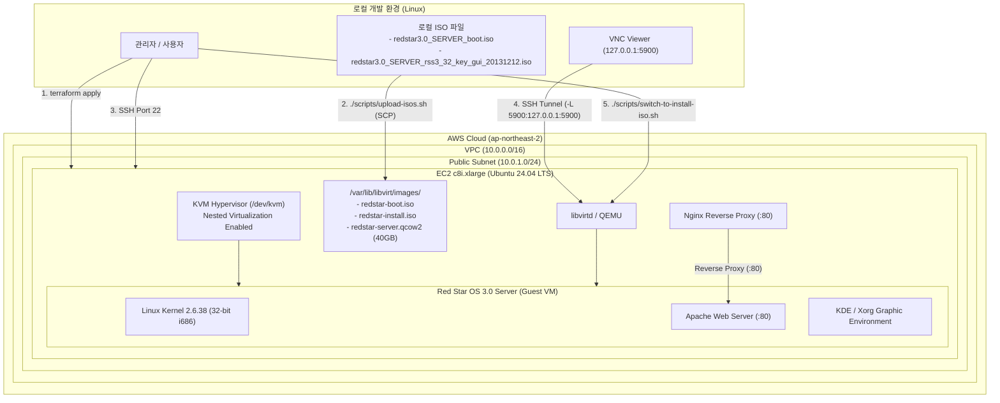

# Red Star OS 3.0 Server on AWS Architecture

이 문서는 AWS EC2 상에서 중첩 가상화(Nested Virtualization)와 KVM 하이퍼바이저를 활용하여 북한의 리눅스 배포판 **붉은별 3.0 서버 (Red Star OS 3.0 Server)** 가상 머신을 안정적으로 구동하는 전체 시스템 아키텍처를 설명합니다.

---

## 1. 시스템 아키텍처 개요

---

## 2. 핵심 구성 요소

### 1) EC2 인스턴스 및 하드웨어 중첩 가상화
- **인스턴스 타입**: `c8i.xlarge` (또는 `c8i.large`)
  - 최신 Intel Xeon 프로세서 기반 Nitro 인스턴스로 AWS의 공식 **하드웨어 중첩 가상화(Nested Virtualization)** 지원.
  - Terraform의 `cpu_options { nested_virtualization = "enabled" }` 설정을 통해 EC2 게스트 OS(Ubuntu) 내부에서 `/dev/kvm` 하드웨어 가속이 활성화됩니다.
  - 기존 Bare Metal(`*.metal`) 인스턴스(시간당 $4 이상) 대비 **95% 이상의 비용 절감** (시간당 약 $0.19) 효과를 제공합니다.

### 2) 스토리지 구조 및 미디어 스왑 (2-ISO Architecture)
Red Star OS 3.0 Server는 초기 부팅용 미디어와 실제 패키지 미디어가 분리된 2장의 ISO 구조를 사용합니다.

| 파일명 (호스트 경로) | 용량 | 역할 |
| :--- | :--- | :--- |
| `/var/lib/libvirt/images/redstar-boot.iso` | ~38MB | 최초 부팅 커널, Anaconda 설치 프로그램 시동 |
| `/var/lib/libvirt/images/redstar-install.iso` | ~856MB | OS 핵심 RPM 패키지, GUI 데스크톱, 서버 패키지 저장소 |
| `/var/lib/libvirt/images/redstar-server.qcow2` | 40GB | Red Star OS 루트 파일시스템 (Sparse Image) |

- 가상 CD-ROM 장치는 IDE 버스(`hdc`)로 구성되어, 설치 프로그램 가동 중에 `virsh change-media` 명령으로 무중단 핫스왑됩니다.

### 3) 게스트 가상 머신 하드웨어 프로파일
- **아키텍처**: 32-bit x86 (i686)
- **메모리**: 2048 MB (Red Star 3.0의 32비트 커널 한계 및 안정성 최적화)
- **vCPU**: 2 Cores
- **네트워크 드라이버**: `e1000` (인텔 기가비트 이더넷 에뮬레이션 - 2.6.38 커널과 완벽 호환)
- **그래픽/디스플레이**: `vga` 비디오 어댑터 + 로컬 바인딩 VNC (5900번 포트)
- **입력 장치**: USB 태블릿(마우스 포인터 정밀 동기화) + PS/2 키보드

### 4) 네트워킹 및 외부 노출 보안 모델
- **VNC 콘솔 보안**: VNC 포트 5900은 AWS Security Group에서 인터넷으로 노출되지 않으며, `127.0.0.1`에만 바인딩됩니다. 원격 접속은 SSH 포트 포워딩 터널링(`ssh -L 5900:127.0.0.1:5900`)을 통해 안전하게 암호화 전송됩니다.
- **HTTP 게이트웨이**: Nginx가 80번 포트를 리스닝하여, VM 설치 중에는 대기 안내 페이지를 서빙하고 설치 후 Red Star OS 웹서버(192.168.122.100:80)로 트래픽을 프록시합니다.
